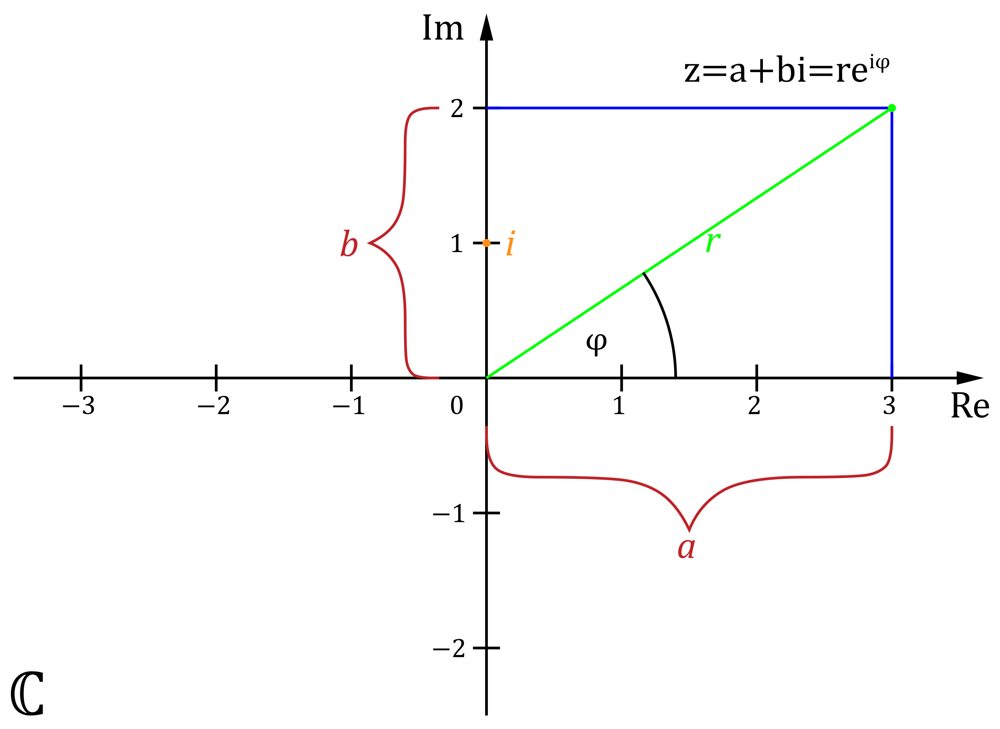
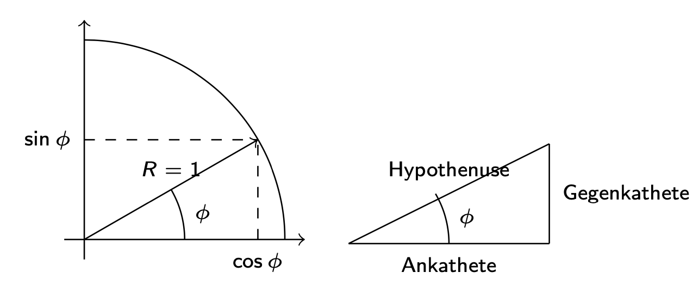

```{r setup, include=FALSE}
knitr::opts_chunk$set(echo = TRUE)
```

**Disclaimer:** *Wir geben keine Garantie auf die Richtigkeit und Vollständigkeit dieses Dokuments. Diese Zusammenfassung soll lediglich einen Überblick über die Inhalte der Vorlesung geben. Klausurrevelant ist theoretisch alles, was in der Vorlesung oder in den Übungsblättern durchgenommen wurde*

# Mathematische Logik

## Aussagen

Wohlformulierte beschreibende Sätze nennt man "Aussagen" (Behauptungen, Mitteilungen). ( (Franz von Kutzschera und Alfred Breitkopf, Einführung in die moderne Logik, 7. neu bearbeitete Auflage, Freiburg im Breisgau, 2000).)

Aussagen besitzen Eigenschaften, welche logisch relevant sind.

Aussagen wären zum Beispiel:

(1) Der Mars hat eine ähnliche Atmosphäre wie die Erde.

(2) Der Mars bewegt sich, abgesehen von Bahnstörungen, auf einer elliptischen Bahn um die Sonne.

Die Aussagen (1) und (2) besitzen einen Wahrheitswert.

Die Aussage (1) ist eine falsche Aussage, die Aussage (2) ist wahr.


### Implikationen

Eine Implikation beschreibt eine Folgerung. 

Eine Implikation wäre zum Beispiel:

 $$(1) \Rightarrow (2)$$ 
 
Eine Implikation hat so wie eine Aussage einen Wahrheitswert.

## Quantoren

$\forall$ : Für alle

$\exists$ : Es existiert mindestens ein

$\exists!$ : Es exsitiert genau ein

$\nexists$: Es exsitiert kein


## Beweise
Um etwas mathematisch zu Beweisen gibt mehrere Ansätze. Die wichtigsten sind:

- **Direkter Beweis:**
  Wir beweisen A $=>$ B mittels A $=>$ A' $=>$ A'' $=>$ B
  
  
  
    Bsp: Sei $n\in\mathbb{N}$ Dann gilt: n ungerade => $n^2$ auch ungerade
  
    n ungerade => $\exists m \in \mathbb{N}: 2m+1=n$ 
    
    =>$(2m+1)^2 = 4m^2+4m+1 = 2(2m^2+2m)+1 => n^2$ 
    
    mit $2(2m^2+2m)\in \mathbb{N}$ und gerade
    
    Da $n^2 = 2(2m^2+2m)$ **+1** ist auch $n^2$ eine ungerade Zahl.
    
- **Kontraposition**
  Anstatt A => B z.z., zeigt man $\neg B => \neg A$
  
  
  
    Bsp: Sei $n\in\{k^2|k\in\mathbb{N}\}$ Dann gilt:
    
    $n$ gerade $=>$ $\sqrt n$ gerade
    
    Kontraposition:
    
    $\sqrt n$ ungerade $->$ n ungerade
    
    $\forall m \in \mathbb{N}:n=k^2 => k^2$ gerade $=> k \ gerade$
    
- **Indirekter Beweis (Widerspruchsbeweis)** (nicht so wichtig)
  
    Wir nehmen $A => B$, dann können wir sagen wenn $\neg B \wedge A => \neg A$ an und zeigen, dass es zum Widerspruch führt
  
    Bsp: Für $A= B = \{-1,1\}$ gilt \ $min(A)*min(B) = min (A*B)$ mit $A*B := \forall a \in A \wedge b \in B, A*B= a*b$
    
    $min(A)=-1, min (B) =-1 , min(A*B) = -1$
    
    $min(A)*min(B)= -1*-1 = 1 \neq -1 = min(A*B)$
    
    

### Beweis über vollständige Induktion

Bei der Vollständigen Induktion wird für eine finite Definitionsmenge die Aussage bewiesen.

Zu zeigen sind:

- **Induktionsanfang**: Die Aussage gilt für das erste Element / die ersten X Element

- **Induktionsannahme**: **Wir nehmen an:** die Aussage gilt für beliebige und feste Elemente der Menge

- **Induktionsbehauptung**: **Wir behaupten**, dass die Aussage auch für alle nachfolgenden Elementer der Menge gilt

- **Induktionschritt** : Wir beweisen, dass für das nächste Element / die nächsten Elemente die Bedingung auch erfüllt wird mittels verwendung der Induktionsannahme

-Bsp: 

$\forall n\ge1$ gilt $\sum_{k=1}^{n} k=\frac{n(n+1)}{2}$

-**Induktionsanfang**: Wir zeigen, dass die Formel für $n=1$ richtig ist.

$\sum_{k=1}^{1} k=1 <=> \frac{1(1+1)}{2}=\frac{2}{2}=1$

-**Induktionsannahme**: Wir nehmen an, $\sum_{k=1}^{n} k=\frac{n(n+1)}{2}$ gilt für alle *feste* und *beliebiege* n.

-**Induktionsbehauptung**: Wir behaupten, dass $\sum_{k=1}^{n+1} k=\frac{(n+1)((n+)+1)}{2}$

-**Induktionsschritt**
Wir zeigen, dass $\sum_{k=1}^{n} k=\frac{n(n+1)}{2}$ für $n -> n+1$ gilt.

$\sum_{k=1}^{n+1} k=(n+1)+\sum_{k=1}^{n} k$

mittels Induktionsannahme nehmen wir an:

$\sum_{k=1}^{n} k=\frac{n(n+1)}{2}$

somit ist 

$\sum_{k=1}^{n+1} k=(n+1)+\sum_{k=1}^{n} k=(n+1)+\frac{n(n+1)}{2}=\frac{2(n+1)}{2}\frac{n(n+1)}{2}$

- ausklammern von (n+1)

$=\frac{(n+2)*(n+1)}{2}=\frac{((n+1)+1)*(n+1)}{2}$ was der Form $\sum_{k=1}^{n} k=\frac{n(n+1)}{2}$ für $n -> n+1$ entspricht

Wir haben mittels Induktionsannahme bewiesen, dass für jedes Element $n$ die gleichung für das darrauffolgende Element $n+1$ gilt. Da die Gleichung für das erste Element $n=1$ gilt und für alle darauffolgenden gilt: $$\sum_{k=1}^{n} k=\frac{n(n+1)}{2} \ \ \ \ \  \forall n\ge1$$

# Mengen und algebraische Strukturen
Mengen sind Zusammenfassungen bestimmter, wohlunterscheidbarer Objekte.
Für jedes Objekt ist eine klare zuordnung zur Menge erkentlich

-------------

Mengen sind keine Aussagen!!

-------------


## Sondermengen & Mengenrelationen
- $\emptyset \subset \mathbb{N} \subset \mathbb{Z} \subset \mathbb{Q} \subset \mathbb{R} \subset \mathbb{C}$
- $A \subset B$ !Aussage!
- $A \cap B$
- $A \cup B$
- $A\setminus B\quad \wedge \quad B\setminus A$
- $A \times B = \left\{ (a,\,b): a \in A, b \in B\right\}$

## Abbildungen
$$f: A \rightarrow B$$

- A $=$ Definitionsmenge, von hier bilden wir ab.
- B $=$ Zielmenge, hierdrauf wird abgebildet.
- Bildmenge: $\subset B$ welche sich aus $f(A)$ ergibt.

1. Injektive Abbildung: $\forall i\in B|~~ \# (a \in A) \leq 1 : f(a) \rightarrow i$
2. Surjektive Abbildung: $\forall i \in B|~~\# (a \in A) \geq 1 : f(a) \rightarrow i$
3. Bijektive Abbildung: $\forall i \in B|~~ \# (a \in A) = 1 : f(a) \rightarrow i \qquad$ (1. $\wedge$ 2.)

### Gruppen $(G, \oplus)$

- **Abgeschlossenheit** $$a \in G, b \in G : a \oplus b \in G$$
- **Assoziativität** $$(a\oplus b) \oplus c = a \oplus (b \oplus c)$$
- **Neutrales Element** $D_{0}$ $$\exists e \in G, \forall a \in G : a \oplus e = a$$
- **Inverses Element** $$\forall a \in G, \exists \bar{a} \in G: a \oplus \bar{a} = e$$
- **Kommultativität** (abelsche Gruppe):$$\forall a \in G, \forall b \in G: a \oplus b = b \oplus a$$

### Ringe $(M, \oplus, \otimes)$

1. $(M, \oplus)$ Ablesche Gruppe
2. $a \otimes ( b \otimes c) = (a \otimes b) \otimes c$ Assoziativität gegeben.
3. Distributiv: $\forall a,b,c \in M : a \otimes (b\oplus c) = a \otimes b \oplus a \otimes c$.

- Kommutativ wenn: $a \otimes b = b \otimes a$
- unitär wenn: $\exists 1 \in M : a \otimes 1 = 1 \otimes a = a$.

### Körper $(K, \oplus, \otimes)$
1. $(K, \oplus)$ is Abelsche Gruppe mit $D_0 = 0$.
2. $(K \setminus \{0\}, \otimes)$ Abelsche Gruppe mit $D_0 = 1$.
3. Distributivgesetz gilt.

- **Unterschied zu Ringen:** $(M, \otimes)$ keine abelsche Gruppe, kein Inverses!

## Vektorrechnung
Vektoren sind tupel mit $n$ elementen ($n = \dim{V}$).  
Sie erfüllen alle bedingungen eines Körpers und lassen sich
nicht mit sich selbst multiplizieren.

- Linearkombination:
$$\vec{z} = \sum _{ i = 1 } ^ k \mu _i \vec{x} _i \in V$$
Hierbei sind $\mu$ skalare $(\mu \in \mathbb{R})$

- Skalarprodukt:
"Vektor multiplikation".  
$$\mathbb{R}^n \mathbb{R}^n = \mathbb{R}$$
Relevant ist, das beide Vektoren gleiche Dimension haben.  
$$ \vec{v} \cdot \vec{w} = \sum _{i = 1} ^n v_i w_i \in \mathbb{R}$$


    *Hinweis: Da Vektoren nicht normal miteinander multipliziert werden können, gehen wir (auch in der Klausur) davon, dass ein Punkt zwischen zwei Vektoren für das Skalarprodukt steht und NICHT für eine normale Multiplikation.*


- Vektor betrag:
$$|\vec{v}|^2 = \vec{v}\cdot\vec{v}$$
$$\Rightarrow |\vec{v}| = \sqrt{\sum_{i = 1} ^n v_i^2}$$
Ein Vektor lässt sich normieren mit: $\vec{e}_v = \frac{\vec{v}}{|\vec{v}|}$.
In $\mathbb{R}^{2}$ gilt: $\vec{e} = \left(\begin{array}{c}\cos \alpha\\ \sin \alpha \end{array}\right)$

- Winkel zwischen Vektoren:  
  Sind vektoren ortogonal ($\alpha = 90^{\circ}$) gilt: $\vec{u}\cdot\vec{v} = 0 \Leftrightarrow \vec{u} \bot \vec{v}$  
  Allgemein berechnet sich der Winkel mit:
  $$\vec{u}\cdot\vec{v} = |\vec{u}||\vec{v}|\cos\theta$$


### Basis eines Vektorraums
Die Basis eines Vektorraums ist die Menge an vektoren,
mit welchen sich über Linearkombination jeder Vektor
im Vektorraum berechnen lässt, sie wird der span des Raums gennant:
$$\forall \vec{v} \in V: \exists \lambda_{1}, \ldots, \lambda_{k} \in \mathbb{R}: \vec{v}=\sum_{i=1}^{n} \lambda_{i} \vec{e}_{i}$$  
Die Vektoren dieser Basis spannen den Vektorraum auf und werden als $\text{span}{V}$ bezeichent, wobei $V :\Leftrightarrow \{\vec{v}_i,\dots, \vec{v}_k\} \in \mathbb{R}^{n}$

Drei relevante Basen sind:

1. Kanonische Basis: $\mathbb{R}^{n} \left\{ \vec{e}_{1} = \left( 1,\dots,0 \right), \vec{e}_{i} = (0,\dots, 1,\dots, 0), \vec{e}_{n} = \left( 0,\dots,1 \right)\right\}\quad i = 1, \dots, n$
2. normierte Basis: $\left\{ \vec{v}_{i} \in X \right\}: |\vec{v}_{i}| = 1~~ \forall i = 1, \dots, n$
3. orthogonale Basis: $\left\{ \vec{v}_{i} \in X \right\}: \vec{v}_{i} \cdot \vec{v}_{j} = 0~~\forall i,j = 1, \dots, n$

Alle Vektoren der Basis des Vektorraums müssen linear unabhängig voneinander sein:
$$\sum_{i=1}^{r} \lambda_{1} \vec{v}_{1}+\ldots_{i}+\lambda_{r} \vec{v}_{r}^{2}=\vec{O} \Leftrightarrow \lambda_{i}=0 \quad i=1, \ldots, r$$
Lineare Abbhängigkeit ist gegeben, wenn $\exists \lambda \neq 0$ sodass $\lambda_1\vec{v}_{1}+\lambda_2\vec{v}_{2} = \vec{0}$.  

Die Dimension des (aufgespannten) Vektorraums entspricht der
Anzahl an Basis oder Span Vektoren.
$$\dim(V) = \# \text{Basis}(V) \quad \text{bzw.} \quad \text{Span}(V)=\mathbb{R}^{\text{dim}(V)}$$

# Komplexe Zahlen und trigonometrische Funktionen

Die Menge $\mathbb{R}$ kann um die Menge $\mathbb{C}$ der komplexen der Zahlen erweitert werden. Dies erlaubt es Gleichungen zu lösen, in der eine Wurzel aus einer negativen Zahl gezogen werden muss z.B. $x= \sqrt{-8}$. 

Hierfür wird die "imaginäre Zahl i" eingeführt, für die gilt: $i^2 = -1$ bzw. $i= \pm \sqrt{-1}$. Die Menge der komplexen Zahlen wird dann definiert als $\mathbb{C} = \{a+ib; a, b \in \mathbb{R} \}$

## Darstellungen Komplexer Zahlen

Generell kann man 3 Darstellungstypen von komplexen Zahlen unterscheiden:

- Kartesische Darstellung

- Darstellung über Polarkoordinaten

- Euler Formel

### Kartesische Darstellung

In der kartesischen Darstellung gilt folgende Schreibweise für komplexe Zahlen: $$z=a+ib$$
mit folgendem reellen und imaginären Teil von z: $$Re(z)=a \quad \quad Im(z)=b$$

Mithilfe der kartesichen Darstellung lassen sich komplexe Zahlen durch einfaches Ablesen des reellen und imaginären Teils in ein 2D-Koordinatensystem abbilden (mit der x-Achse als reelle Achse und der y-Achse als imaginäre Achse).

### Darstellung über Polarkoordinaten

Komplexe Zahlen können auch über Polarkoordinaten dargestellt werden. Die generelle Schreibweise dafür sieht wie folgt aus: $$z=R\cos{\phi}+iR\sin{\phi}$$


$R$ steht für den Betrag der komplexen Zahl und gibt den Abstand von z zum Koordinatenursprung (0,0) an. $$R=\sqrt{a^2+b^2}=\sqrt{z\bar{z}}$$

Der Winkel $\phi$ wird auch als Argument von z bezeichnet und kann mit Hilfe des $\tan$ berechnet werden: $$\tan{\phi}=\frac{b}{a} \quad \Longrightarrow \quad \phi=\arctan{\frac{b}{a}}$$

Vergleicht man die Darstellung über Polarkoordinaten mit der kartesischen Darstellung wird folgender Zusammenhang deutlich: $$Re(z)=a=R\cos{\phi}; \quad \quad Im(z)=b=R\sin{\phi}$$


### Euler Formel

Eine weitere Möglichkeit komplexe Zahlen darzustellen bietet die Euler Formel. Diese sieht wie folgt aus: $$z=Re^{i\phi}$$

Der Vorteil der Eulerformel liegt vor allem in der Berechnung von Produkten und Divisionen komplexer Zahlen. Für normale Addition und Substraktion empfiehlt sich jedoch die kartesische Darstellung.

### Komplexe Zahlen im Koordinatensystem

{width=400px height=300px}

## Rechenoperationen Komplexer Zahlen

Komplexe Zahlen können miteinander verrechnet werden. Hierbei soll am Ende eine neue komplexe Zahl entstehen mit einem reellen und einem imaginären Teil.

Beim Rechnen mit komplexen Zahlen gelten folgende übliche Rechenregeln:

- Addition ($+$) / Subtraktion ($-$)

- Multiplikation ($*$)

- somit auch die Distributivität und Kommuntativität!

Die Ausnahme bildet die Division. Damit man einen reellen und imaginären Teil eines Ausdrucks $\frac{z_1}{z_2}$ definieren kann, muss der Nenner $\in \mathbb{R}$ sein. Dies kann erreicht werden indem man mit der komplex konjugierten Zahl $\bar{z}_2$ der komplexen Zahl im Nenner $z_2$ multipliziert. $$\text{wenn} \quad z=a+ib \quad \text{dann ist} \quad \bar{z}=a-ib$$

$$\Longrightarrow z\bar{z}=(a+ib)(a-ib)=a^2+b^2$$


## Trigonometrische Funktionen

Trigonometrische Funktionen (auch Winkelfunktionen genannt) beschreiben rechnerische Zusammenhänge zwischen Winkel und Seitenverhältnisse. Zu den elementaren trigonometrischen Funktionen gehören:

- $\sin{\phi}$

- $\cos{\phi}$

- $\tan{\phi}$

### Geometrische Interpretation

Zur geometrischen Interpretation ist es wichtig die Definitionen der trigonometrischen Funktionen zu kennne:

$$\cos{\phi}=\frac{\text{Ankathete}}{\text{Hypothenuse}}; \quad  \sin{\phi}=\frac{\text{Gegenkathete}}{\text{Hypothenuse}}; \quad \tan{\phi}=\frac{\text{Gegenkathete}}{\text{Ankathetete}}$$

woraus folgt: $$\tan{\phi}=\frac{\sin{\phi}}{\cos{\phi}}$$

{width=400px height=200px}

### Eigenschaften und wichtige Gleichungen

Trigonmetrische Funktionen weisen aufgrund ihrer Periodizität bestimmte Eigenschaften auf. Die vier wichtigsten sind die folgenden:

- $\sin{(\phi+2k\pi)}=\sin{(\phi)}; \quad \cos{(\phi+2k\pi)}=\cos{(\phi)} \quad \text{mit} k \in \mathbb{R}$

- $\sin{(\phi+\frac{\pi}{2})}=\cos{(\phi)}; \quad \cos{(\phi+\frac{\pi}{2})}=-\sin{(\phi)}$

- $\sin{(\phi+\pi)}=-\sin{(\phi)}; \quad \cos{(\phi+\pi)}=-\cos{(\phi)}$

- $\sin{(-\phi)}=-\sin{(\phi)}; \quad \cos{(-\phi)}=\cos{(\phi)}$

Darüber hinaus gibt es auch einige wichtige Identitäten, die man kennen sollte:

- $\sin^2{\phi}+\cos^2{\phi}=1$

- $\sin{(2\phi)}=2\sin{\phi}\cos{\phi}$

- $\cos{(2\phi)}=\cos^2{\phi}-\sin^2{\phi}=2\cos^2{\phi}-1$

- $\sin{(\alpha+\beta)}=\sin{\alpha}\cos{\beta}+\cos{\alpha}\sin{\beta}$

- $\cos{(\alpha+\beta)}=\cos{\alpha}\cos{\beta}-\sin{\alpha}\sin{\beta}$


### Wichtige Werte

Zur Berechnung von trigonmetrischen Funktionen gibt es einige besondere Werte, die man im Kopf haben sollte.

$$
\begin{array}{l|c|c|c|c|c|c|c}
  \text{Winkel} & 0º & 30º & 45º & 60º & 90º & 180º & 360º \\
  \hline
  \text{Bogenmaß} & 0 & \frac{\pi}{6} & \frac{\pi}{4} & \frac{\pi}{3} & \frac{\pi}{2} & \pi & 2\pi\\
  \hline
  \cos & 1 & \frac{\sqrt{3}}{2} & \frac{\sqrt{2}}{2} & \frac{1}{2} & 0 & -1 & 1\\
  \hline
  \sin & 0 & \frac{1}{2} & \frac{\sqrt{2}}{2} & \frac{\sqrt{3}}{2} & 1 & 0 & 0\\
\end{array}
$$


# Matrizen und Lineare Algebra
Lineare Gleichungssysteme stellen sich wie folgt da:
\[\left\{
\begin{array}{lcll}
    \lambda_{1,\:1}~ x_1 + 
    \lambda_{1,\:\dots }~ x_{\dots} + 
    \lambda_{i,\:1}~ x_i &=& b_1 & \text{Gl.}~ 1 \\
    \lambda_{1,\:\dots}~ x_1 + 
    \lambda_{\dots ,\:\dots}~ x_{\dots} + 
    \lambda_{i,\:\dots }~ x_{i} &=& b_{\dots} & \text{Gl.}~\dots \\
    \lambda_{1,\:j}~ x_1 + 
    \lambda_{\dots,\:j}~ x_{\dots} + 
    \lambda_{i,\:j}~ x_i &=& b_k & \text{Gl.}~ k
\end{array}
\right.\]
Dies lässt sich wie folgt umschreiben: $$Ax = b$$
Dabei sind $x$ und $b$ vectoren.
$A$ ist eine Matrix.
$$ A = \begin{pmatrix}
    \lambda_{1,\:1} & \lambda_{1,\:\dots } & \lambda_{i,\:1} \\
    \lambda_{1,\:\dots} & \lambda_{\dots ,\:\dots} & \lambda_{i,\:\dots } \\
    \lambda_{1,\:j} & \lambda_{\dots,\:j} & \lambda_{i,\:j} \\
\end{pmatrix}$$
Eine Matrix wird durch ihre Dimensionen beschreiben:

- $m$: \# Zeilen
- $n$: \# Spalten

**_Die Lösungsmenge eines LGS ist durch äquivalente umformungen unverändert._**

## Matrixrechung
Matrizen haben folgende Eigenschaften:

1. Assoziativ
2. Distributiv
3. _nicht_ kommutativ!

### Matrix Addition/Subtraktion
Matrizen müssen identische Dimensionen haben.
Addition der einzelnen Elemente aufeinander.

### Matrix Multiplikation
Kriterium: innere Dimensionen gleich. D.h. \# Spalten Matrix $A$ = \# Zeilen Matrix $B$
\[\underset{m\times n}{A} \times \underset{n \times p}{B} = \underset{m \times p}{C}\]
An sich ergibt sich die Ergebnismatrix aus Skalarprodukten der
Zeilen der Matrix $A$ mit den Spalten der Matrix $B$ der Inputmatrizen.
\[
\begin{pmatrix}
    &&\\
    i_1&i_{C}&i_k\\
    &&\\
\end{pmatrix}
\begin{pmatrix}
    &j_i&\\
    &j_{C}&\\
    &j_k&\\
\end{pmatrix}=
\begin{pmatrix}
    &&\\
    &C_{ij}&\\
    &&\\
\end{pmatrix}
\Longleftrightarrow
C_{i,\: j} = \sum_{k = 1}^{n} a_{ik} \cdot b_{jk}
\]

Das neutrale Element der Matrix multiplikation ist die Identitätsmatrix,
eine Diagonalmatrix, mit der Determinante 1:
$$I=
\begin{pmatrix}
    1 & 0 & 0\\
    0 & 1 & 0\\
    0 & 0 & 1\\
\end{pmatrix}
$$

#### Linearkombinationen für Berechnungen:
1. Spalten:  
    $$j_C = x_B^{\: j}\lambda_A + y_B^{\: j} \theta_A + z_B^{\: j} \mu_A$$
    Die Spalte $j$ von $C$ ergibt sich aus der Vektorsumme der Spalten von
    $A$ multipliziert mit den Elementen in der $j$ten Spalte von $B$.
2. Zeilen:
   $$i_C = x_A^{\: i} \lambda_B + y_A^{\: i} \theta_B + z_A^{\: i} \mu_B$$
   Die Zeile $i$ von $C$ ergibt sich aus der Vektersumme der Zeilen von
   $B$ multipliziert mit den Elementen in der $i$ten Zeile von $A$.

### Matrix Transposition
"Rotation einer matrix":  
\[ \underset{m \times n}{A} =
\begin{pmatrix}
    a_{1,1} & \cdots & a_{1,n} \\
    \vdots  &        & \vdots  \\
    a_{m,1} & \cdots & a_{m,n} \\
\end{pmatrix} \longrightarrow
\underset{n \times m }{A}^{T} =
\begin{pmatrix}
    a_{1,1} & \cdots & a_{m,1} \\
    \vdots  &        & \vdots  \\
    a_{1,n} & \cdots & a_{m,n} \\
\end{pmatrix}
\]
Spiegelung um die Diagonale.
```{r, echo = F}
matrix(seq(1,9),nrow = 3)
t(matrix(seq(1,9),nrow = 3))
```
Wenn gilt: $A = A^T$ so ist die Matrix Spiegelsymmetrisch.  
Diagonalmatrizen immer Spiegelsymmetrisch.

### Matrix inverse
Die Inverse Matrix ist das Inverse Element eines Elements in dem Körper
der Matrix Multiplikation.  
Es gilt: $A^{-1} A = AA^{-1} = I$

------------

Nur, aber nicht alle, quadratischen Matrizen sind invertierbar.

------------

Matrizen sind invertierbar, wenn sie nicht-Singulär sind.
$$\exists A \,|\,\det{A} \neq 0 \Rightarrow \exists!\, A^{-1} : AA^{-1} = I$$
Demnach sind LGS mit genau einer Lösung lösbar,
wenn die Matrix invertierbar ist.  


### Matrix Diagonalisierung
Durch Diagonalisierung (alle Elemente der Matrix _über/unter_ Diagonale $=0$)
lassen sich die **Pivot Elemente** (Elemente auf Diagonale) bestimmen.  
Generell:
$$EA = A'$$
Dabei $E=$ Eliminationsmatrix. Eigenschaften:

- Immer invertierbar
- $\det{E} = 1$
- Lower oder Upper Dreiecksmatrix

Die Eliminationsmatrix die Benötigt wird um eine Matrix
vollständig in eine Upper Diagnalmatrix zu überführen ist
die lower Dreiecksmatrix der Matrix A.  
$$\underbrace{E'\underbrace{EA}_{A'}}_{A''}$$
Somit:
$$\underbrace{E''}_{\text{under triangel}}A = \overbrace{A''}^{\text{Upper triangel}}$$
Aus den Dreiecksmatrizen kann man die **Pivot Elemente** ablesen:
$$
\begin{pmatrix}
    \fbox{x} & x & x \\
    0   & \fbox{x} & x\\
    0   & 0 & \fbox{x}\\
\end{pmatrix}
$$


$\blacktriangleright$ Beachte Multiplikationsreihenfolge, nicht kummutativ $\blacktriangleleft$  
$\blacktriangleright$ $E$ sind Einheitsmatrizen und somit 1 auf Diagnoale! ($\det(E) = 1$) $\blacktriangleleft$  

### Determinanten

Die Determinante ist eine reelle Zahl, die NUR für quadratische Matrizen definiert ist.

In einer Matrix mit $\det{A}\neq 0$ gibt es entweder 0 oder $\infty$ viele
Lösungen für Gleichungssysteme.
Die Matrix ist Singulär und hat kein Inverses.

Determinanten können auf verschiedene Arten und weisen berechnet werden:

- Über Pivot-Elemente (für Dreiecksmatrizen)

- Über die Sarrus-Regel (NUR für $3\times3$-Matrizen)

- Über den Laplace'schen Entwicklungssatz

#### Über Pivot-Elemente

Die Determinante einer Upper-triangle-Matrix kann sehr einfach über die Multiplikation der Pivot-Elemente berechnet werden:
$$\det{A} = \prod \text{Pivot Elemente}$$

Daher bietet die Diagonlisierung einer Matrix eine Möglichkeit der Determinanten-Berechnung. 

#### Über die Sarrus-Regel (ACHTUNG nur für $3\times 3$-Matrizen)

{width=200px height=150px} $\Rightarrow a_{11}a_{22}a_{33}+a_{12}a_{23}a_{31}+a_{13}a_{21}a_{32}-a_{31}a_{22}a_{13}-a_{32}a_{23}a_{11}-a_{33}a_{21}a_{12}$ 

#### Über den Laplace'schen Entwicklungssatz

$$\text{det}A=\sum_{i=1}^{n} (-1)^{i+j}a_{ij}\text{det}A_{ij}$$
wobei $A_{ij}$ Matrix A ohne $i$-te Zeile und $j$-te Spalte ist.

#### Eigenschaften von Determinanten

Bei der Berechung von det($A$) müssen folgende Eigenschaften von Determinanten beachtet werden, wenn die Matrix $A$ vorher umgeformt wird:

1. Ein Zeilentausch in der Matrix $A$ hat einen Vorzeichenwechsel (also Multiplikation mit -1) von det($A$) zur Folge. Dieser Vorzeichenwechsel gilt pro Zeilentausch.

$$
\begin{vmatrix}
    a & b \\
    c & d \\
\end{vmatrix} = -
\begin{vmatrix}
    c & d \\
    a & b \\
\end{vmatrix}
$$

2. Eine Multiplikation einer Zeile von $A$ mit einem Faktor $\lambda$ bedeutet, dass man am Ende den berechneten Wert durch diese Faktor teilen muss, da:

$$
\begin{vmatrix}
    \lambda a & \lambda b \\
    c & d \\
\end{vmatrix} = \lambda
\begin{vmatrix}
    a & b \\
    c & d \\
\end{vmatrix}
$$

3. Eine Elimination durch Subtraktion zweier Zeilen hat keine Folge für det($A$), solange die umzuformende Gleichung nicht mit einem Faktor multipliziert wird.

$$
\begin{vmatrix}
    a & b \\
    c-\lambda a & d-\lambda b \\
\end{vmatrix} =
\begin{vmatrix}
    a & b \\
    c & d \\
\end{vmatrix}
$$

$$ \text{Achtung:} \quad
\begin{vmatrix}
    a & b \\
    \lambda c-a & \lambda d-b \\
\end{vmatrix} = \lambda
\begin{vmatrix}
    a & b \\
    c & d \\
\end{vmatrix} \ne
\begin{vmatrix}
    a & b \\
    c & d \\
\end{vmatrix}
$$

4. wenn es eine Null-Zeile gibt oder ein Pivot-Element Null ist, dann ist det($A$) = 0.

5. außerdem gibt es folgende Vereinfachungen bei der Determinantenberechnung:

- $\text{det}(AB)=\text{det}(A)\text{det}(B)$

- $\text{det}(A^{-1})=\frac{1}{\text{det}(A)}$

- $\text{det}(A^m)=(\text{det}(A))^m$

- $\text{det}(\lambda A)=\lambda^n \text{det}(A)$  (mit A = $n\times n$ Matrix)

- $\text{det}(A^T)=\text{det}(A)$


### Spalten und Nullraum
- Spaltenraum:  
  Aufgespannt durch Spalten einer Matrix.
  Dimension ist abhängig von der anzahl linear unabhängiger gleichungen.
- Nullraum:  
  - $\dim span(\vec{0}) = 0$  
  - $\lambda \left(\begin{array}{c}0\\0 \\0 \end{array}\right)$
  - $\sum_{i = 1}^{n} \lambda _{i} \vec{v}_i = \left(\begin{array}{c}0\\0\\0\end{array}\right)$


## Eliminationsverfahren
1. Gleichungssystem aufstellen
2. Gleichungen äquivalent umformen, bis eine dieser nurnoch von einer Variable abhängig ist.
   Erlaubte Umformungen:
   - Permutationen (Gleichungen vertauschen)
   - Skalieren von Gleichungen mit $\lambda \neq 0$
   - Linearkombination von Gleichungen
3. Auflösen der Variable.
4. Resubstitution und schrittweise ermittlung der weiteren Variablen.

### Matrix Erweiterung
Erweiterte Matrix aufstellen $(A|b)$:
\[
\left(\left. 
\begin{matrix}
    a_{1,1} & \cdots & a_{1,n} \\
    \vdots  & \ddots & \vdots  \\
    a_{m,1} & \cdots & a_{m,n} \\
\end{matrix}
\right|
\begin{array}{c}b_1\\ b_{\dots}\\ b_m\end{array}
\right)
\]

Multiplikation der erweiterten Matrix mit E (siehe Diagonalisierung, entweder $L$ oder $U$).  
\[
\left(\left.
\begin{matrix}
    \alpha_{1,1} & \cdots & \alpha_{1,n} \\
    0  & \ddots & \vdots  \\
    0 & 0 & \alpha_{m,n} \\
\end{matrix}
\right|\, E \times \,
\begin{array}{c}b_1\\ b_{\dots}\\ b_m\end{array}
\right)
\]
Damit ist das Gleichungssystem durch substitution von unten nach oben lösbar.
So können sowohl nicht Singuläre systeme vollständig gelöst als auch
die Lösungsmengen Singulärer Systeme bestimmt werden.

### Gauß-Jordan-Verfahren
Hat eine Matrix ein Inverses so kann die Eindeutige Lösung mit diesem Berechnet werden:
$$x = A^{-1}b$$
Um das Inverse einer Matrix zu berechnen, kann man eine Erweiterete Matrix von A mit I aufstellen:

\[
\left(\left.~~\overbrace{
\begin{matrix}
    a_{1,1} & \cdots & a_{1,n} \\
    \vdots  & \ddots & \vdots  \\
    a_{m,1} & \cdots & a_{m,n} \\
\end{matrix}\:}^{A}
\,\,\right|\,\,
\overbrace{
\begin{matrix}
    1 & \cdots & 0 \\
    \vdots  & \diagdown & \vdots  \\
    0 & \cdots & 1 \\
\end{matrix}\:}^{I}~~
\right)
\]
In Schritten wird nun die Linke Matrix ($A$) mittels $E$
in eine $I$ umgewandelt.  
Hierbei wird auch immer $I$ mit $E$ multipliziert.  
Erhalten wird:

\[
\left(\left.~~\overbrace{
\begin{matrix}
    1 & \cdots & 0 \\
    \vdots  & \diagdown & \vdots  \\
    0 & \cdots & 1 \\
\end{matrix}\:}^{EA}~~
\,\,\right|\,\,
\overbrace{
\begin{matrix}
    \alpha_{1,1} & \cdots & \alpha_{1,n} \\
    \vdots  & \ddots & \vdots  \\
    \alpha_{m,1} & \cdots & \alpha_{m,n} \\
\end{matrix}\:}^{EI}~~
\right)
\]
Hierbei ist nun: $EI = A^{-1}$ und wir können somit das Gleichungssystem $x = A^{-1}b$
lösen.

## Lösbarkeit
Lösbarkeit von Gleichungssystemen einteilbar in zwei Untergruppen, wenn $A$ quadratisch:

1. $\det(A) \neq 0 \Rightarrow \exists ! A^{-1}$  
   Das LGS hat genau *_eine und nur eine_* lösung.
   Gaus-Jordan Verfahren anwendbar.  
   Alle Spaltenvektoren Linear unabhängig.
2. $\det(A) = 0 \Rightarrow \nexists A^{-1}$  
   Ein Pivot element in $EA = 0$  
   Im LGS gilt:
   - $0 \in Eb \Leftrightarrow \infty \text{ Lsg.}$
   - $0 \notin Eb \Leftrightarrow 0 \text{ Lsg.}$
