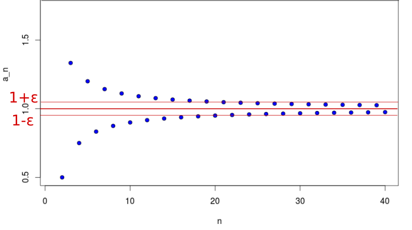
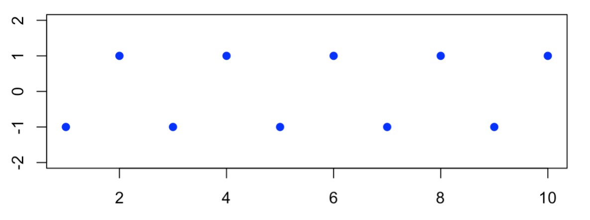

```{r setup, include=FALSE}
knitr::opts_chunk$set(echo = TRUE)
```

**Disclaimer:** *Wir geben keine Garantie auf die Richtigkeit und Vollständigkeit dieses Dokuments. Diese Zusammenfassung soll lediglich einen Überblick über die Inhalte der Vorlesung geben. Klausurrevelant ist theoretisch alles, was in der Vorlesung oder in den Übungsblättern durchgenommen wurde*


# Eigenvektoren, Eigenwerte und Diagonalisierung

## Definitionen

**Eigenvektoren:**

- Der Eigenvektor der Matrix $A$ beschreibt einen Vektor, dessen Richtung durch die Multiplikation mit $A$ nicht verändert, sondern lediglich skaliert wird (ein Vielfaches von sich selbst ergibt). Für den Eigenvektor $x$ bedeutet das: $$Ax=\lambda x$$

**Eigenwert:**

- Der Eigenwert $\lambda$ ist der Skalierungsfaktor eines Eigenvektors $x$.

**Diagonalmatrix:**

- Als Diagonalmatrix bezeichnet man eine Matrix, in der die Elemente außerhalb der Hauptdiagonalen $0$ sind. Man spricht auch dann davon, dass die Matrix eine Diagonalform besitzt.

\

## Bestimmung der Eigenwerte

Die charakteristische Gleichung zur Bestimmung der Eigenwerte einer Matrix $A$ lautet: $$\text{det}(A-\lambda I_n)=0$$

*Beispiel:* 
$$ 
A =
\begin{pmatrix}
1 & 2 \\
4 & -1
\end{pmatrix} 
$$
\

$$
\det\left|\: A - \lambda I\: \right| = \left|
\begin{array}{ccc}
{1-\lambda} & 2 \\ 
4 & {-1-\lambda} \\ 
\end{array}\right| = 0
$$ 
\

$$
\begin{array}{rclr}
\Longrightarrow \quad (1-\lambda)\cdot(-1-\lambda)-4\cdot 2 & = & 0 \\
-1 + \lambda^2 -8 & = & 0\\
\lambda^2 & = & 9 \\
\\
\Rightarrow \lambda_1 & = & 3  \\
\
\lambda_2 & = & -3 \\
\end{array}
$$

\

## Bestimmung der Eigenvektoren

Sind die Eigenwerte $\lambda$ bestimmt können die dazugehörigen Eingenvektoren bestimmt werden. Hierfür löst man für jeden Eigenwert $\lambda$ das lGS $$(A-\lambda I)u = 0$$

*Beispiel:* 

Für $A$ aus unserem vorherigen Beispiel ergeben sich folgende Eigenvektoren:
\
Für Eigenwert $\lambda_1$:
$$
\left[
\begin{pmatrix}
    1 & 2 \\
    4 & -1 \\
\end{pmatrix} -
\begin{pmatrix}
    3 & 0\\
    0 & 3\\
\end{pmatrix}
\right]\, \times \left(
\begin{array}{c}
  u_{1x} \\
  u_{1y}
\end{array}\right) = \vec{0}
$$
\

$$
\left(
\begin{matrix}
  -2 & 2 \\
  4 & -4 \\
\end{matrix} \left| \
\begin{matrix}
  0\\
  0\\
\end{matrix} \right.
\right)
\underset{\text{II+2} \cdot\text{I}}{\Longrightarrow} 
\left(
\begin{matrix}
  -2 & 2 \\
  0 & 0 \\
\end{matrix} \left| \
\begin{matrix}
  0\\
  0\\
\end{matrix} \right.
\right) \\
$$

Für Eigenwert $\lambda_2$:
$$
\left[
\begin{pmatrix}
    1 & 2 \\
    4 & -1 \\
\end{pmatrix} -
\begin{pmatrix}
    -3 & 0\\
    0 & -3\\
\end{pmatrix}
\right]\, \times \left(
\begin{array}{c}
  u_{2x} \\
  u_{2y}
\end{array}\right) = \vec{0}
$$
\

$$
\left(
\begin{matrix}
  4 & 2 \\
  4 & 2 \\
\end{matrix} \left| \
\begin{matrix}
  0\\
  0\\
\end{matrix} \right.
\right)
\underset{\text{II-I}}{\Longrightarrow} 
\left(
\begin{matrix}
  4 & 2 \\
  0 & 0 \\
\end{matrix} \left| \
\begin{matrix}
  0\\
  0\\
\end{matrix} \right.
\right) \\
$$
\

$$
\begin{aligned}
\Longrightarrow4u_{2x} + 2u_{2y} = 0  & \Rightarrow & \text{möglicher Eigenvektor:} & u_2= \begin{pmatrix} 2\\ 4\\ \end{pmatrix} \\
& \Rightarrow & \text{allgemeiner Eigenvektor:} & u_2= \begin{pmatrix} \beta\\ 2\beta\\ \end{pmatrix}
\end{aligned}
$$
\

## Diagonalisierung

Wenn $A$ eine quadratische $n \times n$ Matrix ist gilt:

Wenn $A$ $n$ linear unabhängige Eigenvektoren besitzt, kann $A$ in eine Diagonalform gebracht werden. Umgekehrt bedeutet dies, dass $A$ nicht diagonlisiert werden kann, wenn die Eigenwerte mit $k>1$ Multiplizität, $p<k$ unabhängige Eigenvektoren haben.

$$
S^{-1}AS=\Lambda = \begin{pmatrix} \lambda_1 & & 0 \\ & \ddots & \\ 0 & & \lambda_n \end{pmatrix}
$$

mit $S$ als Spaltenmatrix der Eigenvektoren und $\lambda_i$ als Eigenwerte von $A$.

Daraus folgt auch:

$$
AS=S \Lambda \quad \quad \text{und} \quad \quad A=S \Lambda S^{-1}
$$

Das bedeutet, man kann auch die Matrix $A$ berechnen, wenn man ihre Eigenvektoren und Eigenwerte kennt, sofern die Bedingung für Diagonalisierung erfüllt ist.

*Beispiel:* 

Für $A$ aus unserem vorherigen Beispiel:

$$
S= \begin{pmatrix} 1 & 2 \\ 1 & 4\end{pmatrix} \quad \quad \text{und} \quad \quad \Lambda= \begin{pmatrix} 3 & 0 \\ 0 & -3 \end{pmatrix}
$$

\

Das Potenzieren von $A$ kann vereinfacht werden, wenn $A$ diagonalisierbar ist, denn es dann gilt:

$$
A^k = S\Lambda^k S^{-1}
$$
\

Für den Fall einer symmetrischen Matrix ($A^T=A$) gilt (sofern sie diagonalisierbar ist):

- $S$ ist eine orthogonale Matrix und agiert geomatrisch als eine Rotationsmatrix im Raum $\mathbb{R}^n$.

- Wenn die Spaltenvektoren von $S$ normiert sind, dann gilt außerdem $S^TS=I$, woraus folgt $S^T=S^{-1}$.

Geometrisch lässt sich die Wirkung einer symmetrischen Matrix $A=S \Lambda S^{-1}$ auf einen Vektore daher in 3 unabhängige geomatrische Transformationen zerlgen:

1. $S^{-1}$: Rotation der Basis ($u_1, \dots , u_n$) auf die kanonische Basis ($e_1, \dots, e_n$) von $\mathbb{R}^n$.

2. $\Lambda$: Skalierung der kanonischen Axen um $\lambda_1, \dots, \lambda_n$

3. $S$: Rotation zurück in die Basis ($u_1, \dots, u_n$)

\

*Mehr zu Eigenvektoren und Eigenwerten sowie anderen Begriffen in diesem Zusammenhang (z.B. Multiplizität), findet ihr auf dem Begriffeblatt*
  

# Folgen, Funktionen und Reihen

## Folgen

*Definition:* Eine Folge ist eine Abbildung der natürlichen Zahlen in eine Zahlenmenge $M$ (z.B. $\mathbb{R}$):

$$
a: \quad 
\begin{matrix}
\mathbb{N} \rightarrow M \\
n \rightarrow a_n
\end{matrix}
$$
\

### Explizite und rekursive Folgen

**Explizite Folgen:**

Bei expliziten Folgen können die Folgenglieder unabhängig von den anderen Gleidern bestimmt werden, z.B.:

$$ a_n = \left( 1+ \frac{1}{n} \right)^n$$

\

**Rekursive Folgen:**

Bei rekursiven Folgen werden Folgenglieder anhand anderer Folgenglieder bestimmt, z.B. Fibonacci-Folge:

$$f_{n+1}=f_n +f_{n-1} $$
Bei rekursiven Folgen müssten die Anfangswerte definiert werden (also $f_0$ und $f_1$ bei der Fibonacci-Folge)

Achtung: unterschiedliche Anfangswerte führen zu unterschiedlichen Folgen!

\

### Beschränktheit und Monotonie

**Beschränkheit:**

Eine Folge $a_n$ heißt beschränkt, falls es eine Zahl $k$ gibt, sodass gilt:

$$ \forall n \in \mathbb{N}: |a_n| \leq k $$
Hierbei kann genau definiert werden, ob $a_n$ nach **unten/oben beschränkt** ist:

$$ \forall n \in \mathbb{N}: a_n \geq k \quad \quad (\text{untere Beschränkheit})$$
$$ \forall n \in \mathbb{N}: a_n \leq k \quad \quad (\text{obere Beschränkheit})$$

*Beispiel:*

Für $a_n = 1 - \frac{1}{n+1}$ gilt:

- $a_n$ ist nach oben beschränkt, da $\forall n \in \mathbb{N}: a_n \leq 1$
- $a_n$ ist nach unten beschränkt, da $\forall n \in \mathbb{N}: a_n \geq 0$

\

**Monotonie:**

Eine reelle Folge ($a_n$) ist **monoton wachsend** wenn: 
$$\forall n \in \mathbb{N}: a_{n+1} \geq a_n$$

bzw. **strikt monoton wachsend** wenn:

$$\forall n \in \mathbb{N}: a_{n+1} > a_n$$
\

Eine reelle Folge ($a_n$) ist **monoton fallend** wenn: 
$$\forall n \in \mathbb{N}: a_{n+1} \leq a_n$$
bzw. **strikt monoton fallend** wenn:

$$\forall n \in \mathbb{N}: a_{n+1} < a_n$$
\

Monotonie kann über zwei Varianten bewiesen / untersucht werden:

1. das Vorzeichen von $a_{n+1} - a_n$ untersuchen und zeigen, dass es stets positiv/negativ ist

2. wenn gilt $\forall n \in \mathbb{N}: a_n >0$, untersuchen, ob $\frac{a_{n+1}}{a_n}$ größer oder kleiner als $1$ ist.

*Hinweis:* Der Beweis über Variante 2 setzt voraus, dass man mittels vollständiger Induktion zeigt, dass $\forall n: a_n >0$ gilt.

\


### Konvergenz, Divergenz und Grenzwerte

**Konvergenz:**

Der Grenzwert einer Folge ist über den Abstand der Folge zum Grenzwert definiert: Eine Folge $a_n$ hat einen Grenzwert a wenn für alle $\epsilon >0$ ab einem gewissen $n_0 \in \mathbb{N}$ für alle $n \geq n_0$ gilt, dass $|a_n - a| < \epsilon$. Das bedeutet anschaulich: Für jeden noch so kleinen Abstand $\epsilon$ sind alle Folgeglieder ab einem gewissen Glied näher an diesem Grenzwert als der Abstand:

$$\forall \epsilon > 0, \exists n_0 \in \mathbb{N}: \quad \forall n \geq n_0 \quad |a_n - a| \leq \epsilon$$

Vereinfacht bedeutet Konvergenz bei Folgen, das Annähern einen einen bestimmten Wert für $n \rightarrow \infty$. Man spricht in diesem Fall auch von einem Grenzwert:

$$\underset{n \rightarrow \infty}{lim} a_n = a$$
{width=600px height=400px}

Wenn die Folge $a_n$ gegen 0 konvergiert ($\underset{n \rightarrow \infty}{lim} a_n = 0$), spricht man auch von einer **Nullfolge**.

Konvergenz kann auch mit Monotonie und Beschränktheit zusammenhängen. Eine Folge ist **auf jedenfall konvergent, wenn:**

1. sie **monoton steigend und nach oben beschränkt** ist.

2. sie **monoton fallen und nach unten beschränkt** ist.

Es gibt auch andere Fälle in denen eine Folge konvergent ist, z.B. ist in der oberen Abbildung eine Folge dargestellt, die nach oben und unten Beschränkt ist, aber keine Monotonie aufweist. Dennoch konvergiert diese Folge.

\

**Divergenz:**

Eine Folge, wird dann als divergent bezeichnet, wenn sie nicht konvergent ist. Dabei gibt es zwei Arten von Divergenz:

- eine Folge ist **auf jeden Fall divergent, wenn sie nicht beschränkt** ist.

- eine Folge kann aber **auch divergieren, obwohl sie beschränkt ist** z.B. bei $a_n = (-1)^n$

{width=800px height=200px}


\

**Rechenregel zur Grenzwertbestimmung:**

Bei Folgen kann es manchmal sein, dass es bei der Grenzwertbestimmung zu einen der folgenden Ausdrücke kommt: 

$\frac{0}{0}; \quad \frac{\infty}{\infty}; \quad 0\cdot \infty; \quad 0^\infty ; \quad 0^0; \quad \infty - \infty$

In diesen Fällen, kann man bestimmte Rechenregeln anwenden, um die Grenzwerte zu bestimmen. Folgende Rechenregeln gelten für zwei konvergente Folgen ($a_n$ und $b_n$) mit den Grenzwerten ($a$ und $b$):

- $\underset{n \rightarrow \infty}{lim} \lambda a_n = \lambda a$

- $\underset{n \rightarrow \infty}{lim} a_n^{p/q} = a^{p/q}$ für $p, q \in \mathbb{N}$

- $\underset{n \rightarrow \infty}{lim} a_n \pm b_n = a \pm b$

- $\underset{n \rightarrow \infty}{lim} a_n b_n= ab$

- $\underset{n \rightarrow \infty}{lim} \frac{a_n}{b_n}= \frac{a}{b}$ wenn $b \neq 0$

Der Grund, warum wir uns auch Rechenregeln mit zwei konvergenten Folgen anschauen, ist, dass man oft in der Lage ist, eine Folge, die bei der Grenzwertbestimmung einen undefinierbaren Ausdruck liefert (siehe oben), in zwei Folgen umzuschreiben.

*Beispiel:*

Für 
$$a_n = \frac{2n^3+n-3}{n^3-4n+5}$$

würden wir bei der Grenzwertbestimmung folgendes herauskommen:

$$\underset{n \rightarrow \infty}{lim} a_n =  \frac{\infty}{\infty}$$

Daher macht es Sinn hier den Zähler und Nenner als zwei eigene Folgen zu betrachten, welche jeweils einen definierten Grenzwert ergeben. Hierzu teilen wird zuerst Nenner und Zähler durch $n^3$ (dadurch wird $a_n$ nicht verändert). Wir können nun $a_n$ nun betrachten als:

$$a_n = \frac{b_n}{c_n} = \frac{2+\frac{1}{n^2}-\frac{3}{n^3}}{1-\frac{4}{n^2}+\frac{5}{n^3}}$$

$b_n$ und $c_n$ sind konvergente Reihen und daher:

$$
\begin{aligned}
\underset{n \rightarrow \infty}{lim} a_n =  \underset{n \rightarrow \infty}{lim} \frac{b_n}{c_n} & =  \frac{\underset{n \rightarrow \infty}{lim}\left(2+\frac{1}{n^2}-\frac{3}{n^3}\right)}{\underset{n \rightarrow \infty}{lim} \left(1-\frac{4}{n^2}+\frac{5}{n^3}\right)} \\
& = \frac{\underset{n \rightarrow \infty}{lim}(2)+\underset{n \rightarrow \infty}{lim}\left(\frac{1}{n^2}\right)-\underset{n \rightarrow \infty}{lim}\left(\frac{3}{n^3}\right)}{\underset{n \rightarrow \infty}{lim} (1)-\underset{n \rightarrow \infty}{lim}\left(\frac{4}{n^2}\right)+\underset{n \rightarrow \infty}{lim} \left(\frac{5}{n^3}\right)} \\
& = \frac{2+0+0}{1+0+0}=2
\end{aligned}
$$


## Funktionen


### Allgemeine Konzepte zu reellen Funktionen


### Stetigkeit und Grenzwerte


### Differenzierbarkeit und Kurvendiskussion


## Reihen


### Kovnergenzkriterien


### Potenzreihen


### Taylorreihen
  
  
  
  
  
  
  
  
  
  